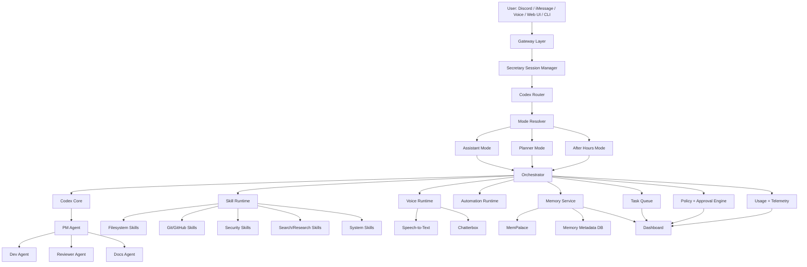

Perfect. If you are committed to **Codex as the main brain**, then I would not fight that. I would just design the system so Codex is the default reasoning/execution core, while the rest of the stack exists to make Codex more effective: routing, memory, approvals, channels, voice, and observability.

That is very doable. Codex already supports the pieces that matter most for this design: parallel threads, worktree-based repo workflows, automations, Git functionality, and subagents/custom agents. ([OpenAI Developers][1])

MemPalace is also a reasonable fit for your memory layer because it is local-first, installable as a Python package, uses Chroma under the hood, and is positioned as an MCP-capable memory system. There is active discussion around its benchmark claims, so I would use it because it is practical and local, not because of the headline scores alone. ([GitHub][2])

Below is the blueprint I would use.

---

# Project definition

**Working name:** SecretaryOS
**Mission:** a 24/7 local-first personal agent platform for your Mac Studio, with Codex as the primary reasoning engine, MemPalace as persistent memory, Discord/iMessage/voice as client interfaces, and a dashboard for control, usage, and task oversight.

## Product pillars

1. **One face to the user**

   * The Secretary is the single conversational entrypoint.
   * She can switch modes, personas, and channels without losing memory continuity.

2. **Codex-first execution**

   * Codex handles planning, coding, repo work, complex reasoning, and agent delegation by default.
   * Other models are fallback/specialty lanes, not the center.

3. **Externalized memory**

   * Memory lives outside the model in MemPalace plus app metadata.
   * Model swaps do not break continuity.

4. **Safe autonomy**

   * The system can act on your behalf, but approval classes gate risky actions.

5. **Composable skills**

   * Add new tools without redesigning the whole architecture.

---

# System architecture



---

# The repo layout

I would build this as a monorepo.

```text
secretary-os/
  apps/
    dashboard/              # Next.js web dashboard
    api/                    # Main backend/orchestrator API
    worker/                 # Background task workers
    gateway-discord/        # Discord bot adapter
    gateway-imessage/       # iMessage adapter (via bridge)
    gateway-voice/          # Voice session service
  packages/
    core/                   # Shared types, contracts, constants
    orchestrator/           # Mode resolver, router, task launcher
    codex-runtime/          # Codex client wrappers, job specs
    memory/                 # MemPalace integration + retrieval logic
    skills/                 # Skill registry + tool adapters
    policy/                 # Approval classes, authz, risk checks
    personas/               # Persona definitions and prompt packs
    telemetry/              # Usage tracking and analytics
    channels/               # Shared gateway abstractions
    prompts/                # Prompt templates, mode instructions
    events/                 # Pub/sub event schemas
  infra/
    docker/                 # Local compose files
    scripts/                # Bootstrap, dev scripts
    sql/                    # Migrations
  docs/
    architecture/
    product/
    runbooks/
  data/
    persona-packs/
    memory-imports/
    task-artifacts/
  .env.example
  turbo.json / pnpm-workspace.yaml
  README.md
```

---

# The services

## 1. Gateway Layer

This is how the user talks to the system.

### Discord gateway

* slash commands
* normal chat relay
* thread support for task runs
* approvals via buttons
* status updates pushed into Discord

### iMessage gateway

* bridge via BlueBubbles or a similar local relay
* message receive/send
* optional contact allowlist
* lightweight mode switching via keywords or slash-style commands

### Voice gateway

* push-to-talk and full duplex later
* session state
* STT input
* TTS output through Chatterbox

### Web dashboard

* admin and monitoring
* task history
* usage graphs
* persona editor
* model routing settings
* approval inbox

---

## 2. Secretary Session Manager

This is the “single face” abstraction.

Responsibilities:

* track the active conversation
* know current mode
* know current persona
* keep channel-specific session IDs
* store ephemeral context for the current turn
* inject memory and project context before Codex sees the request

This is where the user feels like they are talking to “her,” even though many services sit behind the scenes.

---

## 3. Codex Router

Because you want Codex as the main brain, the router’s job is not “should I use Codex?”
It is:

* which Codex workflow should I use?
* which mode instructions should I attach?
* should this be a single-agent or multi-agent Codex run?
* should this be interactive or background task style?
* is memory retrieval needed first?
* are approvals needed before execution?

### Codex workflows

I would define these built-in workflows:

* `chat_assistant`
* `planner_deep_dive`
* `repo_execute`
* `repo_audit`
* `filesystem_reorg`
* `markdown_runbook_execute`
* `security_sweep`
* `daily_checkin`
* `after_hours_roleplay`

Codex subagents are especially useful for the repo workflows, where PM/Dev/Reviewer/Docs can split work. ([OpenAI Developers][3])

---

## 4. Orchestrator

This is the application brain around Codex.

Responsibilities:

* accepts normalized requests
* retrieves memory
* composes the execution packet
* launches Codex jobs
* invokes skills
* manages approvals
* stores results and artifacts
* updates channels and dashboard

This service should be deterministic in control flow, with Codex used for reasoning and content generation inside each lane.

---

## 5. Memory Service

This is where MemPalace comes in.

## Memory design

Use **two layers**:

### Layer A: MemPalace

Use it for:

* raw conversation archival
* semantic search over past chats
* cross-session recall
* project/topic retrieval
* long-term continuity for Assistant and After Hours

### Layer B: App metadata DB

Use Postgres for structured memory:

* personas
* mode settings
* active projects
* deadlines/events
* pinned facts
* follow-up reminders
* memory write logs
* retrieval analytics

That split matters. MemPalace is good for semantic recall, but you still want structured facts and scheduling in your own DB. MemPalace currently presents itself as local-first, installable with `pip install mempalace`, and built around Chroma and MCP-adjacent usage. ([GitHub][2])

## Memory categories

Every memory write should carry:

* `kind`: conversation | project | event | preference | persona | repo | task
* `scope`: global | persona | repo | project | channel
* `tags`: freeform labels
* `source`: discord | imessage | voice | dashboard | codex_task
* `importance`: 1-5
* `visibility`: assistant | planner | after_hours | all

## Retrieval pipeline

For every turn:

1. collect session context
2. detect topic/project
3. query structured DB for exact facts
4. query MemPalace for semantic recall
5. rerank
6. inject a compact memory block into Codex

## Write policy

Do not dump every token blindly into structured memory.
Write to:

* raw transcript archive always
* semantic memory often
* structured memory only when the fact is durable or actionable

---

## 6. Skill Runtime

Skills are tool adapters with contracts.

### Core skills for MVP

* `filesystem.list`
* `filesystem.organize`
* `filesystem.move`
* `filesystem.safe_delete`
* `git.status`
* `git.branch`
* `git.commit`
* `git.push`
* `github.pr.create`
* `repo.audit`
* `repo.search`
* `security.scan`
* `markdown.execute_plan`
* `web.search`
* `usage.codex.report`
* `usage.openrouter.report`
* `persona.switch`
* `mode.switch`

Each skill should declare:

* input schema
* output schema
* risk level
* approval class
* dry-run support
* audit log behavior

---

## 7. Policy and approval engine

This is one of the most important services.

## Approval classes

### Class 0

No approval required.

* answering questions
* reading files
* memory retrieval
* generating plans
* reporting usage
* searching the web
* drafting messages/commits

### Class 1

Soft approval or configurable auto-run.

* repo lint/test
* local security scans
* branch creation
* reorganizing files in a preview/staging area
* markdown checklist execution in dry-run mode

### Class 2

Explicit approval required.

* `git push`
* mass file moves
* deleting files outside staging
* changing default model routes
* changing personas globally
* sending proactive messages outside standard cadence

### Class 3

Locked down.

* secrets manipulation
* shell scripts with elevated risk
* account-level integrations
* destructive system actions

The dashboard and Discord should both surface approval prompts.

---

## 8. Task Queue

You want a 24/7 system, so tasks must be durable.

Use Redis-backed jobs or Postgres-backed queues with workers for:

* Codex jobs
* memory indexing
* proactive follow-ups
* voice jobs
* security sweeps
* nightly repo checks
* usage aggregation

### Task states

* queued
* planning
* awaiting_approval
* running
* review
* complete
* failed
* canceled

### Task artifact storage

Store:

* prompts/instructions used
* files changed
* diffs
* logs
* output summaries
* links to commit hashes/PRs
* memory writes generated

---

# Personas and modes

These are not the same thing.

## Modes

Modes are operational behavior:

* Assistant
* Planner
* After Hours

## Personas

Personas are style/identity overlays:

* Secretary Default
* Formal PM
* Casual friend
* Specific RP character

That separation lets you run:

* Planner mode + Formal PM persona
* Assistant mode + Secretary Default persona
* After Hours mode + Character X persona

## Persona pack structure

Each persona pack should include:

* display name
* avatar
* system style block
* behavioral traits
* allowed channels
* memory scope rules
* response formatting preferences
* voice config
* optional lore file for After Hours

Store persona packs in files plus DB references so they are editable in the dashboard and swappable via slash command.

---

# Codex agent topology

Since you want Codex as the center, here is the concrete topology.

## Top-level Codex roles

### 1. Secretary Codex

Default front-facing Codex brain.

* understands requests
* asks clarifying questions when needed
* delegates to workflows
* summarizes results back to you

### 2. PM Codex

Used for large engineering tasks.

* scopes work
* defines milestones
* chooses subagents
* defines acceptance tests

### 3. Dev Codex

Writes code and executes implementation.

### 4. Reviewer Codex

Checks diffs, tests, regressions, style, and safety.

### 5. Docs Codex

Updates docs, changelogs, setup guides, and internal notes.

### 6. After Hours Codex

Special prompt pack for long-form immersive roleplay and casual conversation, with heavier persona context.

Codex’s current subagent capability fits this well. ([OpenAI Developers][3])

## Workflow examples

### Example: “Build this new feature”

1. Secretary Codex classifies as `repo_execute`
2. PM Codex writes scoped plan
3. Dev Codex implements in worktree
4. Reviewer Codex runs checks
5. Docs Codex writes docs
6. system requests approval for merge/push
7. Secretary summarizes outcome

### Example: “Push that change I forgot last night”

1. Secretary retrieves recent repo task memory
2. checks local git status
3. drafts commit summary
4. requests Class 2 approval
5. executes push
6. logs result and memory

### Example: “Read my huge markdown and execute step by step”

1. parse markdown into actionable runbook items
2. create task chain
3. PM Codex validates ordering and dependencies
4. worker executes step by step with checkpoints
5. progress streamed to dashboard/Discord

---

# Data model blueprint

Use Postgres for app state.

## Main tables

### `users`

Usually just you for now, but support future expansion.

### `sessions`

* id
* channel
* channel_user_id
* active_mode
* active_persona_id
* started_at
* last_active_at

### `personas`

* id
* slug
* name
* description
* mode_compatibility
* prompt_pack_path
* voice_profile_id
* enabled

### `projects`

* id
* name
* repo_path
* tags
* default_branch
* codex_profile
* memory_scope_id

### `tasks`

* id
* type
* status
* requested_by_session_id
* project_id
* mode
* persona_id
* approval_class
* created_at
* started_at
* completed_at
* summary

### `task_steps`

* id
* task_id
* step_index
* label
* status
* output
* artifact_path

### `approvals`

* id
* task_id
* action_name
* requested_at
* approved_at
* denied_at
* channel
* reason

### `memory_items`

Structured companion table, not replacing MemPalace.

* id
* external_memory_id
* kind
* scope
* project_id
* persona_id
* importance
* tags
* created_at

### `events`

* id
* title
* due_at
* source_session_id
* followup_policy
* status

### `usage_records`

* id
* provider
* lane
* model
* task_id
* input_tokens
* output_tokens
* estimated_cost
* timestamp

### `model_routes`

* id
* lane
* provider
* model_name
* enabled
* priority

### `skills`

* id
* name
* version
* risk_level
* enabled

---

# Dashboard pages

## 1. Home

* current mode
* active persona
* pending approvals
* recent tasks
* current usage
* follow-ups due today

## 2. Tasks

* live queue
* task detail page
* artifacts
* logs
* Codex summaries
* retry/cancel buttons

## 3. Memory

* search memory
* inspect retrieved chunks
* pin facts
* delete or reclassify memories
* view by project/persona

## 4. Personas

* create/edit persona packs
* assign voices
* preview style
* mode compatibility

## 5. Models

* set default routes
* Codex lanes
* OpenRouter fallback
* local model bindings
* per-mode model policy

## 6. Usage

* Codex usage by day
* by repo
* by workflow
* by persona/mode
* OpenRouter usage
* total trend lines

## 7. Integrations

* Discord status
* iMessage bridge status
* voice service status
* GitHub auth/config
* memory health

---

# Voice stack blueprint

Chatterbox is a strong starting TTS option, and its repo currently highlights a Turbo variant meant to be faster and lighter than the larger models. ([GitHub][4])

## Voice pipeline

1. microphone input
2. STT transcription
3. Secretary session manager receives text
4. Codex / workflow execution
5. response text returned
6. Chatterbox synthesizes speech
7. audio played back
8. transcript stored in memory

## Voice-specific needs

* interruption handling
* low-latency short utterance mode
* full-response narration mode
* persona-linked voice assignment
* optional voice clone per persona

Because Chatterbox has active open issues, keep the TTS service behind a clean adapter so you can swap it later if needed. ([GitHub][5])

---

# Proactive texting blueprint

You specifically want proactive behavior. Build it as a scheduler plus event engine.

## Trigger types

* daily planning prompt
* event reminder
* inactivity check-in
* repo/task follow-up
* emotional/social after-hours nudge

## Example policies

* every morning: “What does your day look like?”
* before known events: “You had a test today — want help reviewing?”
* after a long coding task: “Want me to package this into a cleaner plan?”

## Required controls

* quiet hours
* max proactive messages/day
* per-channel enable/disable
* persona-aware tone
* opt-out button

---

# MVP build order

## Milestone 1: Skeleton

* monorepo
* dashboard shell
* API service
* worker service
* Discord gateway
* session manager
* mode + persona switching
* Postgres + Redis setup

## Milestone 2: MemPalace integration

* install and wrap MemPalace
* transcript ingest
* semantic retrieval
* tag by project/topic
* structured memory metadata table
* retrieval panel in dashboard

## Milestone 3: Codex core

* Codex client wrapper
* Secretary Codex
* Planner workflow
* repo_execute workflow
* task queue integration
* artifact logging

## Milestone 4: skills

* filesystem read/organize
* git status/commit/push
* repo audit
* markdown runbook execution
* usage reporting

## Milestone 5: approvals + telemetry

* approval engine
* Discord approval buttons
* usage tracking
* task detail page
* Codex/OpenRouter usage graphs

## Milestone 6: After Hours

* persona packs
* heavier lore prompts
* model route overrides
* memory scope refinements

## Milestone 7: voice

* STT input
* Chatterbox service
* persona-linked voices
* voice conversation mode

## Milestone 8: iMessage

* bridge integration
* allowlist
* slash-style commands
* proactive follow-ups

---

# Recommended prompt layering

Since Codex is your main brain, keep prompts modular.

## Base system prompt

* identity of the Secretary
* tool discipline
* approval behavior
* memory usage rules
* channel behavior

## Mode prompt

* Assistant behavior
* Planner depth and structure
* After Hours immersion style

## Persona prompt

* tone
* mannerisms
* formatting
* relationship framing

## Task prompt

* current objective
* project/repo context
* memory snippets
* allowed skills
* acceptance criteria

That layering prevents your prompt from becoming a giant OpenClaw-style blob.

---

# Risks and how to design around them

## 1. Codex overuse

Even with your high allowance, you do not want waste.
Mitigation:

* compact memory injection
* strict workflow templates
* only spawn subagents for substantial tasks
* summarize old context aggressively before each task

## 2. Memory bloat

If you store everything badly, retrieval quality drops.
Mitigation:

* separate raw archive from curated structured memory
* use tags/scopes
* allow memory pinning and pruning

## 3. Unclear autonomy boundaries

Mitigation:

* approval classes
* visible audit trail
* dry-run support for risky skills

## 4. Persona contamination

After Hours should not bleed into repo operations.
Mitigation:

* separate mode prompts
* separate retrieval filters
* visibility fields on memory items

---

# My concrete recommendation for your first build target

Build this exact MVP first:

**Discord-first Codex secretary with MemPalace-backed memory, dashboard, repo task execution, git actions, markdown runbook execution, persona switching, and usage reporting.**

That gives you:

* real utility fast
* Codex-heavy usage
* memory continuity
* a visible product shell
* a solid base for voice and iMessage later

---

# What I would name the initial internal modules

* `secretary-gateway`
* `secretary-session`
* `codex-core`
* `codex-workflows`
* `memory-bridge`
* `persona-engine`
* `approval-engine`
* `task-runner`
* `usage-observer`
* `dashboard-ui`

---

# Final blueprint summary

Your stack should look like this:

* **Main brain:** Codex, across assistant/planner/repo workflows ([OpenAI Developers][1])
* **Memory:** MemPalace for semantic long-term recall, Postgres for structured facts and events ([GitHub][2])
* **Voice:** Chatterbox behind an adapter layer for persona TTS ([GitHub][4])
* **Control plane:** your own orchestrator, approvals, tasks, telemetry
* **Interfaces:** Discord first, then dashboard, then voice, then iMessage
* **Autonomy style:** proactive but gated
* **Architecture style:** one secretary on top, many clean subsystems underneath

The next best step is to turn this into a **repo starter pack**: actual folders, `.env.example`, database schema, event contracts, and the first milestone task list you can hand straight to Codex.

[1]: https://developers.openai.com/codex/app?utm_source=chatgpt.com "Codex app"
[2]: https://github.com/milla-jovovich/mempalace?utm_source=chatgpt.com "milla-jovovich/mempalace: The highest-scoring AI memory ..."
[3]: https://developers.openai.com/codex/subagents?utm_source=chatgpt.com "Subagents – Codex"
[4]: https://github.com/resemble-ai/chatterbox?utm_source=chatgpt.com "resemble-ai/chatterbox: SoTA open-source TTS"
[5]: https://github.com/resemble-ai/chatterbox/issues?utm_source=chatgpt.com "Issues · resemble-ai/chatterbox"
