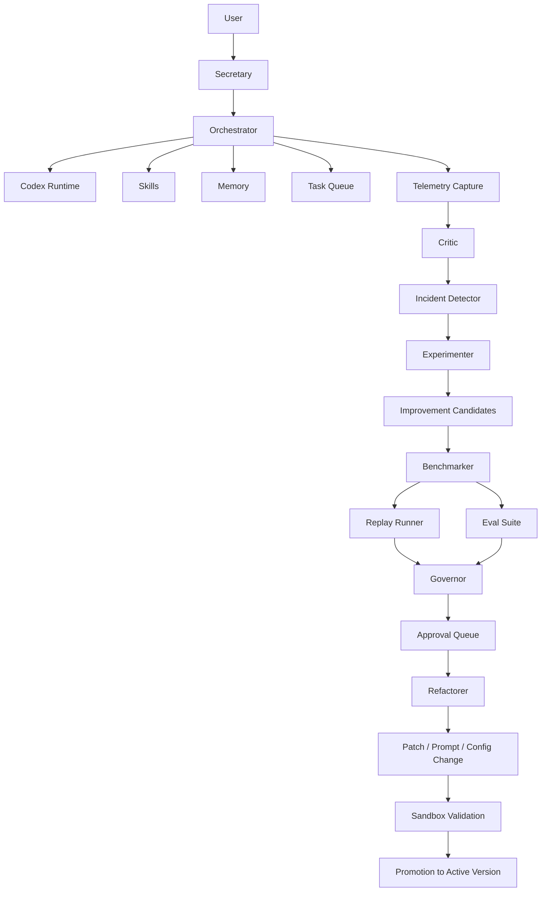

The right move is to make it **self-improving in the control plane**, not self-modifying everywhere at once.

Do **not** let it freely rewrite itself. Make it improve through a loop:

**observe → evaluate → propose → sandbox → verify → approve → adopt**

That gives you a system that gets better over time without turning into chaos.

# The target architecture

Your current system already has the bones:

* secretary interface
* orchestrator
* Codex runtime
* workers
* memory
* dashboard
* skills

Now add a second layer above execution:

## 1. Execution layer

This is your current system. It handles user requests, Codex tasks, skills, memory, and channels.

## 2. Improvement layer

This is new. It watches how the system performs and tries to improve it.

It should contain five agents:

### Critic

Reviews completed tasks and conversations.

Looks for:

* where the assistant misunderstood you
* where a workflow was too slow
* where a skill failed
* where memory retrieval was weak
* where the wrong mode/persona was used
* where approvals were annoying or missing

### Experimenter

Turns those problems into concrete improvement ideas.

Examples:

* “change memory retrieval top_k from 8 to 5 for coding tasks”
* “use planner mode automatically when request length exceeds threshold”
* “split repo_execute into PM and Dev phases earlier”
* “add a dry-run preview to filesystem reorganize”
* “tighten After Hours memory isolation”

### Benchmarker

Tests the new idea in a sandbox.

It should run:

* eval tasks
* replay conversations
* synthetic workload tests
* known benchmark prompts
* regression checks

### Refactorer

Implements bounded improvements in code, prompts, configs, or workflows.

Important: this agent should only be allowed to touch approved surfaces.

### Governor

Decides whether a change is:

* rejected
* kept as experiment
* proposed for approval
* promoted to production

That is your self-improvement loop.

# What can safely self-improve

Start with these four surfaces only.

## A. Prompts

Safest and highest leverage.

Let the system improve:

* mode prompts
* task prompts
* persona prompt formatting
* workflow instructions
* memory injection formatting

Track versions and compare results.

## B. Routing rules

Let it tune:

* when to invoke planner mode
* when to use markdown_runbook_execute
* when to require approval
* when to retrieve project memory
* which workflow to select for certain request patterns

This is huge for quality.

## C. Memory strategy

Let it improve:

* tagging
* reranking
* retrieval top_k
* scope filters
* write thresholds
* summarization cadence

This is one of the best areas for self-improvement.

## D. Skills and workflows

Let it propose:

* new skills
* missing tool arguments
* safer defaults
* better step decomposition
* missing validations

Do **not** start with unrestricted codebase rewrites.

# What must not self-improve at first

Lock these down initially:

* secrets handling
* auth
* approval engine core rules
* filesystem root permissions
* production deployment config
* model provider credentials
* destructive shell capabilities

Those should remain human-controlled.

# The concrete system design

Add these packages/apps:

```text
packages/
  evals/
  improvement/
  experiments/
  replays/
  governance/

apps/
  evaluator-worker/
```

## `packages/evals`

Stores evaluation definitions.

Examples:

* coding task success evals
* repo audit quality evals
* memory retrieval quality evals
* conversation tone evals
* planner usefulness evals

Each eval should have:

* input
* expected behavior
* scoring rubric
* optional golden output
* tags like `coding`, `memory`, `after_hours`, `discord`

## `packages/replays`

Stores captured real interactions that can be replayed.

Examples:

* “user asked to push forgotten Git change”
* “user asked to reorganize files”
* “user chatted casually in After Hours”
* “user asked for architecture planning”

These become your regression suite.

## `packages/improvement`

Core logic for:

* issue detection
* hypothesis generation
* candidate patch proposals
* improvement scoring

## `packages/experiments`

Handles:

* prompt version A/B tests
* routing policy experiments
* memory strategy experiments
* workflow experiments

## `packages/governance`

Defines:

* allowed improvement surfaces
* promotion rules
* rollback rules
* approval requirements

# New database tables

Add these:

## `eval_runs`

* id
* eval_name
* task_id
* candidate_id
* score
* passed
* notes
* created_at

## `improvement_candidates`

* id
* type
* title
* description
* target_surface
* proposed_by
* status
* created_at

## `experiments`

* id
* candidate_id
* variant_name
* config_json
* status
* created_at
* completed_at

## `experiment_results`

* id
* experiment_id
* metric_name
* metric_value
* notes

## `system_incidents`

* id
* task_id
* category
* severity
* summary
* root_cause_guess
* created_at

## `prompt_versions`

* id
* scope
* name
* content
* version
* active
* created_at

## `policy_versions`

* id
* surface
* config_json
* version
* active
* created_at

## `replay_cases`

* id
* name
* category
* input_payload
* expected_traits
* created_at

# The self-improvement loop in practice

## Step 1: Capture everything

After each task, store:

* user input
* selected mode/persona
* memory used
* workflow chosen
* skills invoked
* approvals triggered
* result
* user response if available
* latency
* token usage
* failures

## Step 2: Score every run

Create automatic scoring on:

* success/failure
* latency
* retries
* tool errors
* approval friction
* memory usefulness
* user satisfaction signals

Simple examples:

* Did the task complete?
* Did it require multiple clarifications?
* Did a skill fail?
* Was wrong memory injected?
* Did the user re-explain themselves?

## Step 3: Detect incidents

When patterns repeat, open an incident.

Examples:

* markdown tasks frequently need clarification
* repo_execute often overuses memory
* After Hours leaks into work chat
* Discord slash commands produce poor context continuity

## Step 4: Generate candidates

The Experimenter proposes a small change.

Examples:

* alter planner auto-trigger threshold
* change memory retrieval weights
* reword repo_execute instructions
* add stricter output formatting for reviewer
* add a new skill precheck

## Step 5: Test in sandbox

Run candidate against:

* replay cases
* eval suite
* synthetic prompts
* maybe a shadow mode on live traffic later

## Step 6: Compare metrics

Promote only if better on:

* completion rate
* lower regressions
* lower token waste
* lower latency
* fewer incidents

## Step 7: Human approval for promotion

At least early on, all promoted changes should require your approval.

# The most valuable first self-improvement features

Build these first.

## 1. Conversation and task replay

This is the most important feature.

You need to be able to replay past interactions against a new prompt/config/workflow and compare outcomes.

Without replay, “self-improvement” is just guessing.

## 2. Prompt versioning

Every major prompt should be versioned.

At minimum:

* secretary base prompt
* assistant mode
* planner mode
* after_hours mode
* repo_execute workflow
* memory injection template

Then you can test:

* old prompt vs new prompt
* compare scores
* keep winner

## 3. Routing optimizer

Let the system improve when it chooses:

* assistant vs planner
* memory heavy vs memory light
* direct answer vs queued task
* skill-only vs Codex full reasoning

This will noticeably improve quality fast.

## 4. Memory evaluator

Have the Critic ask:

* did retrieved memory actually help?
* was irrelevant memory injected?
* should this memory have been structured instead?
* should this conversation become a replay case?

This is one of the best ways to make the whole system smarter.

## 5. Skill failure learner

Every failed skill run should automatically generate:

* failure summary
* likely cause
* retry recommendation
* possible code fix candidate

That creates a natural pipeline for system improvement.

# How to keep it safe

Use three promotion tiers.

## Tier 1: Auto-adopt

Safe changes only:

* analytics labels
* nonfunctional instrumentation
* new eval cases
* prompt wording experiments in shadow mode

## Tier 2: Approval-required

* prompt replacements
* routing changes
* memory config changes
* new skill defaults
* workflow step changes

## Tier 3: Locked

* core policy changes
* auth/security
* secrets
* destructive tool permissions
* deployment behavior

# The new agent graph



# The exact milestones I would add

## Milestone 14 — telemetry and replay capture

Build:

* full task telemetry capture
* normalized interaction logs
* replay case storage
* replay runner CLI/API

## Milestone 15 — eval framework

Build:

* eval definitions
* scoring engine
* benchmark worker
* pass/fail dashboards

## Milestone 16 — prompt and policy versioning

Build:

* prompt registry
* version tables
* active/inactive promotion system
* rollback support

## Milestone 17 — improvement engine

Build:

* Critic
* incident detector
* candidate generator
* experiment manager

## Milestone 18 — governed self-refinement

Build:

* bounded refactor agent
* sandbox patch testing
* approval queue for promotion
* automatic rollback on regressions

# Codex prompts to build this

Start with this:

```text
Design and implement a replay and evaluation subsystem for SecretaryOS.

Requirements:
- Add packages/evals, packages/replays, packages/improvement, and packages/governance.
- Add database tables for eval_runs, improvement_candidates, experiments, experiment_results, system_incidents, prompt_versions, policy_versions, and replay_cases.
- Capture completed task executions into normalized replay records.
- Build a replay runner that can rerun prior interactions against current prompts and configs without mutating production state.
- Add an API and dashboard page for viewing replay cases and eval results.
- Keep the design modular and typed.
- Do not yet implement autonomous self-modification. Focus on observability, replay, and evaluation infrastructure.
```

Then:

```text
Implement prompt versioning and experiment support for SecretaryOS.

Requirements:
- Version system prompts, mode prompts, and workflow prompts.
- Support active/inactive prompt versions with rollback.
- Add an experiment runner that can compare two prompt versions against replay cases and score results.
- Add dashboard pages for prompt versions, experiment results, and promotion decisions.
- Require approval before promoting a prompt version to active.
```

Then:

```text
Implement a governed improvement engine for SecretaryOS.

Requirements:
- Add a Critic that reviews completed tasks and flags likely incidents.
- Add an Experimenter that proposes bounded improvement candidates targeting prompts, routing rules, memory settings, or workflow configs.
- Add a Governor that decides whether a candidate should be rejected, kept experimental, or submitted for approval.
- Restrict candidate targets to safe surfaces only. Do not allow arbitrary codebase self-modification.
- Integrate results into the dashboard and approval flow.
```

# My strongest recommendation

Do **not** begin with “let the agent rewrite its own code.”

Begin with:

* replay
* evals
* prompt versioning
* routing experiments
* memory experiments

That alone will make it feel dramatically smarter, and it will do so in a controlled way.

Once that is stable, then you let it propose code patches to:

* prompts
* workflow configs
* skill wrappers
* noncritical modules

That is how you get a true self-improving system without building a monster.


